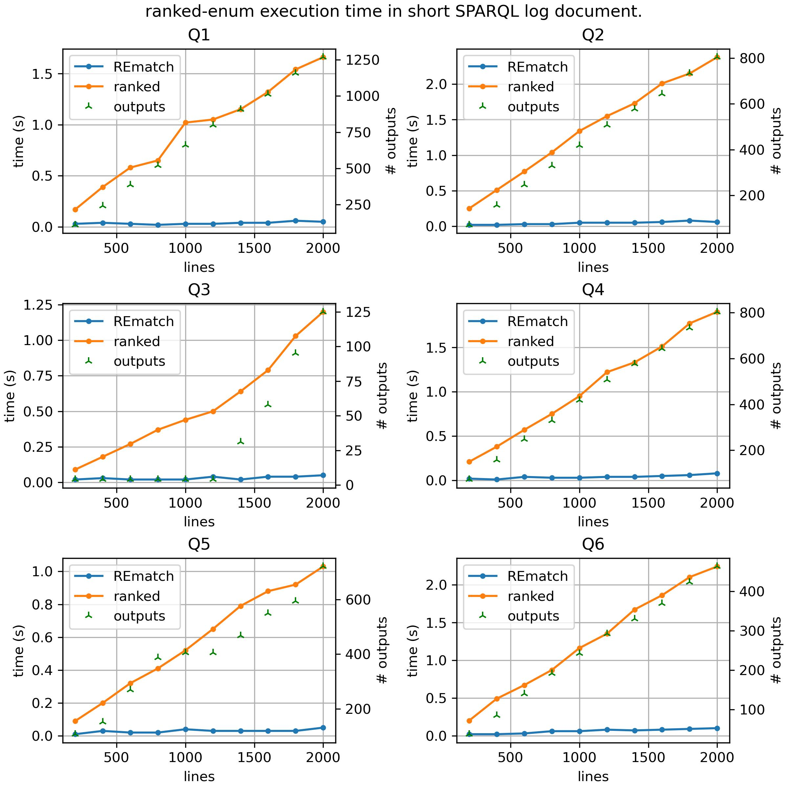
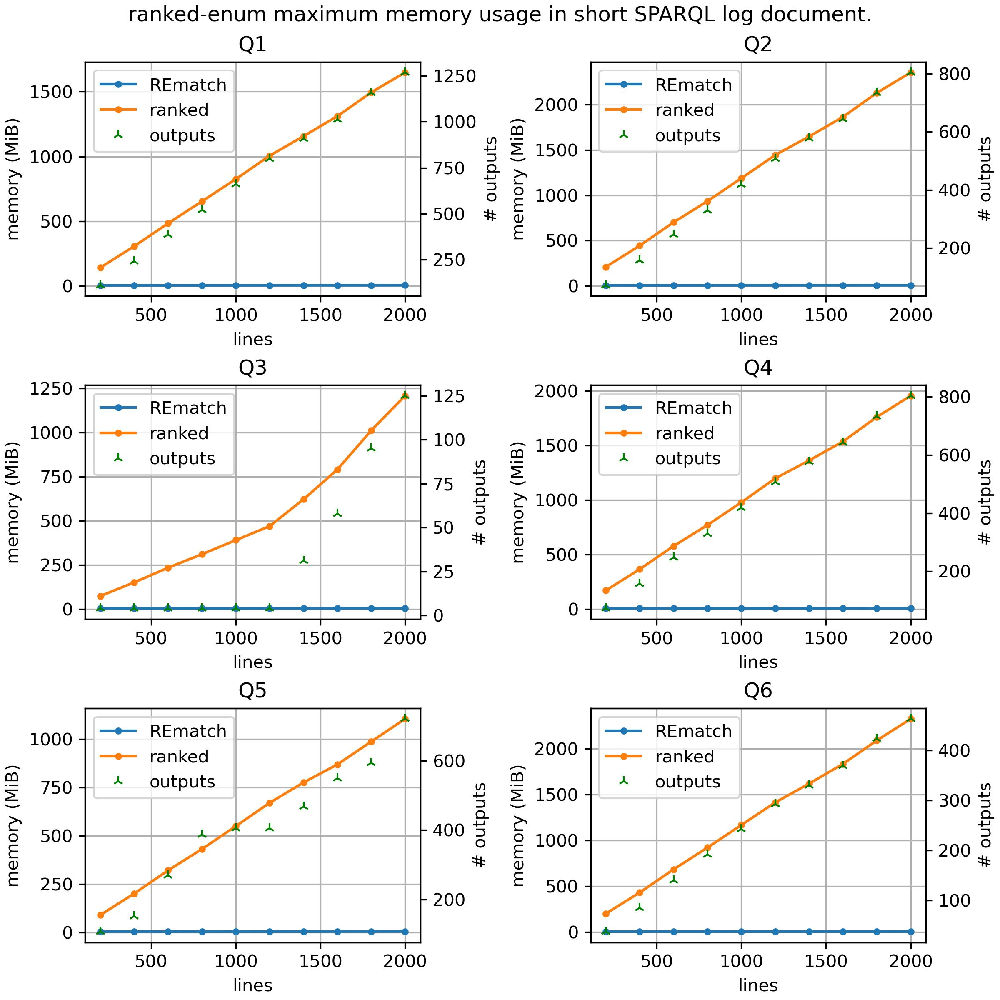

# Ranked REmatch Enumeration
## User Documentation
Here we present the tool to make use of the ranked enumeration experimental feature inside the REmatch project. This part asumes that the user already has the ```ranked``` binary file. If not then please refer to the developer documentation.

##### Common usage
The usage of the `ranked-enum` tool depends on a storage file for the weighted-DFA that we'll use as an input pattern. Luckily, the tool has a determinization output option:
```
build/Release/bin/ranked-enum -e '.*!x{a|b}.*' --determinize > A1.txt
```
With that we generate the transition table for the weighted-DFA in the file `A1.txt`. Now we can call the tool with that input:
```
build/Release/bin/ranked-enum -t 'abba' -a A1.txt
```
We can also call the tool with a document file `doc.txt` as input:
```
build/Release/bin/ranked-enum -d doc.txt -a A1.txt
```
For example we can get the following mappings with their corresponding values:
```
x = |1,2> (2.43)
x = |2,3> (2.82)
x = |0,1> (3.07)
x = |3,4> (3.61)
```
As the example shows, the corrects mappings will be ordered from lowest to highest value.
##### Editing the weighted-VA transitions
The user however might want to input his own weights to the input automaton. If we look at `A1.txt`:
```
t 6 {.|()|0.79} 8
t 3 {[ab]|(>x)|0.59} 6
t 2 {.|(x<)|0.17} 3
t 8 {.|()|0.33} 8
t 0 {\0|(x<)|0.9} 3
t 3 {b|()|0.58} 7
t 3 {a|()|0.85} 5
t 2 {.|()|0.72} 2
t 0 {\0|()|0.42} 2
f 6 {0.99}
f 8 {0.13}
i 0 {0.15}
```
The wVA table is pretty simple, we have first the transitions which use the syntax
```
t [state1] {[charclass]|([captures])|[weight]} [state2]
```
Which codes that there is a transition from `state1` to `state2` labeled with `charclass` and with `captures` and is weighted with `weight`.

Also we have lines with the syntax:
```
f [state] {[weight]}
i [state] {[weight]}
```
That codes that a certain `state` is initial or final (`i` or `f`) and with a certain initial/final `weight`. It is imposed the restriction that **the weighted automaton has only one initial state**.

The user then might try to change the weights in particular for the transitions manually, and then input the resulting file to the `ranked-enumeration` tool.

## Experiments
As a simple experiment, we have provide different random-weighted DFA's based on a set of simple queries acting on logs of sparql. Here we show the first 3 lines of the original 2000 lines document (`1.2 MiB`):
```
Sat,  8 Nov 2014 04:03:50 +0000	bm.rkbexplorer.com	sparql	PREFIX id: <http://bm.rkbexplorer.com/id/> PREFIX rdf: <http://www.w3.org/1999/02/22-rdf-syntax-ns#> PREFIX rdfs: <http://www.w3.org/2000/01/rdf-schema#> PREFIX owl:  <http://www.w3.org/2002/07/owl#> PREFIX bm:   <http://www.britishmuseum.ac.uk/ontologies/conservation#> SELECT DISTINCT ?a_analysisDate, ?a_analysisTitle, ?a WHERE { <http://bm.rkbexplorer.com/id/merlin-PDB354> bm:hasObjectScience ?analysis . ?analysis bm:ID ?a ; bm:analysisTitle ?a_analysisTitle OPTIONAL {?analysis bm:analysisDate ?a_analysisDate }}
Sat,  8 Nov 2014 04:03:51 +0000	darmstadt.rkbexplorer.com	sparql	ASK WHERE   { ?s ?p ?o } 
Sat,  8 Nov 2014 04:03:52 +0000	bm.rkbexplorer.com	sparql	PREFIX id: <http://bm.rkbexplorer.com/id/> PREFIX rdf: <http://www.w3.org/1999/02/22-rdf-syntax-ns#> PREFIX rdfs: <http://www.w3.org/2000/01/rdf-schema#> PREFIX owl:  <http://www.w3.org/2002/07/owl#> PREFIX bm:   <http://www.britishmuseum.ac.uk/ontologies/conservation#> SELECT DISTINCT ?e_agreedTreatment,?e_treatmentReason, ?t_treatmentEndDate, ?c, ?e, ?t WHERE { <http://bm.rkbexplorer.com/id/merlin-JCF4286> bm:hasObjectConservation ?c . ?c bm:hasConservationEvent ?e . ?e bm:hasTreatment ?t ; bm:treatmentReason ?treatmentReasonTerm . ?t bm:parentConservation ?c OPTIONAL {?e bm:agreedTreatment ?e_agreedTreatment } . OPTIONAL { ?treatmentReasonTerm rdfs:label ?e_treatmentReason } . OPTIONAL { ?t bm:treatmentEndDate ?t_treatmentEndDate } }

```
We divided this document in 10 different documents, each one containing the first `200*i` lines for `1 <= i <= 10`.

### Results
Our results for the execution time and memory usage of the tool `ranked-enum` compared to the usage of the `rematch` tool are summarized in the following plots:





### Analysis

We observe that the execution of the ranked algorithm is significantly slower when compared to the _un-weighted_ version (the `REmatch` library). This, in our opinion, is closely related to the fact that the memory usage is much grater also.

The problem araises when we consider that the Heaps of Words are getting allocated seamesly for every possible run considered through the document. Unlike `REmatch`'s execution, `ranked-enum`'s execution doesn't implement a garbage collector optimized for accounting unuseful runs in the wVA.

It is then needed to implement some kind of _pruning_ over the DAG-structure of Heaps. This seems not trivial to do, at least not in the same way that `REmatch` does it, mainly because of the intricacy of the data structures. One should have to dynamically reuse the DAG's allocated space procedurally through the evaluation. We propose this optimization for future work.

## Developer Documentation
We now present a developer documentation for the compilation of the codebase and the classes/structures present in it.

### Installation

First, `ranked-enum` has a dependency on CMake (>= 3.14) and the Boost Libraries (>= 1.58). This are the dependencies of `REmatch` also. We asume that the user is on a Debian-based distro. For windows installation of these dependencies we recommend to follow the links of the projects homepages.

To install CMake and Boost Libraries:
```
sudo apt-get install cmake libboost-all-dev
```
To build the project
```
cmake -H. -Bbuild/Release
cmake --build build/Release
```
Consequently, the `ranked-enum` tool will be at `build/Release/bin/ranked-enum`. For more information on the usage refer to:
```
build/Release/bin/rematch --help
```

### Files
The tool is embedded inside the `REmatch` project, which its execution is relatively complex inside its codebase. However this guide serves only for the code related to the `ranked-enumeration` tool. The following files are the important ones in the code of the `ranked-enumeration` tool:
```
src/
├── rematch/
│   ├── automata/
│   │   └── wnfa/
│   │       └── wnfa.hpp
│   ├── evaluation/
│   │   ├── ranked_evaluator.hpp
│   │   └── ranked_evaluator.cpp
│   ├── parse/
│   │   └── automata/
│   │       └── wva/
│   │           ├── ast.hpp
│   │           ├── grammar.hpp
│   │           ├── parser.cpp
│   │           ├── parser.hpp
│   │           ├── visitor.cpp
│   │           └── visitor.hpp
│   └── structs/
│       └── how/
│           ├── binomial_heap.hpp
│           ├── heap.hpp
│           ├── how_paper.hpp
│           ├── how.hpp
│           └── iheap.hpp
└── targets/
    └── main/
        ├── interface.cpp
        ├── interface.hpp
        └── ranked-enum.cpp
```
This documentation is not extensive, and we'll focus on the automaton, evaluation algorithm and DAG-like data structure sublaying in the tool's execution. For more information please refer to the docstrings inside the code base.
### Classes
#### Automata
##### Weighted Variable Automaton (`class WeightedVA<T,G>`)
This is the class that stores the weighted automaton's graph along with the access to the table of variable and charclasses codings.

It is templated in the way that one can define the type of the stored data inside the Heaps (type `T`), and the type of the order group used to order the heap elements (type `G`).

Generally in the algorithm we'll use `T = {std::bitset<32>, long}` to store the _(S,i)_ data (_S_ being a capture and _i_ an index), and `G = double`.

`WeightedVA` then defines its very own `State` class, and `State` defines its own `Transition` class. These being the classes used on to construct the automaton's graph.

###### Member variables
+ `std::vector<State*> states_`
     Every state in the automaton's graph.

+ `std::vector<State*> accepting_states_`
     Every accepting (i.e. final) state in the automaton's graph.

+ `State* init_state_`
     The initial state in the automaton's graph.

+ `G init_weight_`
     The initial weight in the automaton's graph.

+ `std::shared_ptr<FilterFactory*> ffact_`
     Access to the filter factory table (for corresponding charclasses present in the input regex to codes).

+ `std::shared_ptr<FilterFactory*> vfact_`
     Access to the variable factory table (for corresponding variable names present in the input regex to codes).

###### Member functions (non-trivial ones):
+ `WeightedVA(const LogicalVA &A)`
     Constructor of a wVA from a LogicalVA (automaton constructed after parsing a normal REmatch expression).

+ `void set_random_weights(double lw_bound, double up_bound)`
     Sets random weights to every transition in the automaton's graph using an uniform distribution with parameters `lw_bound` and `up_bound`.

+ `void fix_useful_states()`
     Remove every state that is not reachable from the initial state or that doesn't reach an accepting state.

##### State (`class WeightedVA<T,G>::State`)
The `State` class defines an inner `Transition` class. It stores the arrays for accesing forward and backward transitions.

It also stores a _transition map_ that serves to map every interval of possible characters to an array of transitions that should trigger with any character of the corresponding interval (now only ASCII is supported: [0, 127]).

It also has two pointers to a _Heap of Words_-like structure, which is necessary for the `RankedEvaluator`'s execution.

###### Member variables
+ `uint id_`
     A state's unique id.

+ `std::vector<Transition*> transitions_`
     Every transition that starts from the state.

+ `std::vector<Transition*> backward_transitions_`
     Every transition that ends on the state.

+ `std::vector<IntervalMap> tmap_`
     The state's mapping from the alphabet to the set of all the subsets of transitions in the automaton's graph. `IntervalMap` is just a simple struct that stores an interval of characters along with an `std::vector<Transition*>` for every transition labeled with the elements of the character interval. This vector is always ordered with respect of the order of the intervals, and such are the intervals that they are never overlapping between one and other. We use the member function `update_transition_map` to correctly update the map.

+ `bool initial_, bool accepting_`
     Booleans to denote if the state is initial or accepting, respectively.

+ `G initial_weight_, G accepting_weight_`
    The weight associated to the state if it's initial or accepting.

+ `HoWPaper<T,G> *heap_, HoWPaper<T,G> *heap_`
     Heap of Words pointers associated to the current state at a particular time during the evaluation algoritm's execution. Used inside the `RankedEvaluator`'s main algorithm.

+ `std::shared_ptr<FilterFactory*> ffact_`
    Access to the filter factory table (for corresponding `CharClasses` (also called _filters_) present in the input regex to codes).
###### Member functions (non-trivial ones):
+ `std::vector<Transition*> next_transitions(char a) const`
     Searches on `tmap_` using binary search to get the corresponding transitions that are labeled with `a` and start from the state.

+ `Transition& add_transition(uint code, capture_t S, G weight, State* next)`
     Adds a transition that starts from the state and with the parameters that are given. Returns a reference to the constructed transition.

+ `void update_transition_map(Transition* t)`
     Update the transitions map `tmap_` accordingly after adding `t` to the transition's array.
#### Heaps
We use inheritance extensively for our specification of the heaps used in the ranked enumeration's algorithm. Here we show a little class diagram of the different classes.
```

+-------------------+           +--------------------+
|                   |           |                    |
|  HeapOfWords<T,G> |           |      Heap<T,G>     |
|                   |           |                    |
+-------------------+           +--------------------+
          |                                |
          |                                |
       inherits                         inherits
          |                                |
          |                                |
+-------------------+           +--------------------+
|                   |           |                    |
|   HoWPaper<T,G>   |           |IncrementalHeap<T,G>|
|                   |           |                    |
+-------------------+           +--------------------+
          |                               |
          |                               |
     composition                       inherits
          |                               |
          |                               |
          |                    +--------------------+
          |                    |                    |
          +------------------- |  BinomialHeap<T,G> |
                               |                    |
                               +--------------------+
```
##### Heap of Words (`class HeapOfWords<T,G>`)
A `HeapOfWords<T,G>` is an abstract templated class. Its main use is to define the interface of a _Heap of Words_-like structure.

Same as `WightedVA<T,G>`, this class is templated in the way that one can define the type of the stored data inside the Heaps (type `T`), and the type of the order group used to order the heap elements (type `G`).

###### Member functions (non-trivial ones):
+ `virtual HeapOfWords<T,G>* add(T obj, G val) const`
 The _Add_ function found in the paper, this time applied on the HoW object. . Return the resulting `HeapOfWords` after the addition in a fully-persistant way.

+ `virtual HeapOfWords<T,G>* extend_by(T obj) const`
 The _ExtendBy_ function found in the paper, this time applied on the HoW object. Return the resulting `HeapOfWords` after the extension in a fully-persistant way.

+ `virtual std::list<T> find_min() const`
The _FindMin_ function found in the paper, this time applied on the HoW object. Returns an `std::list<T>` representing the "_word_" of `T` objects that's minimum inside the HoW.

+ `virtual HeapOfWords<T,G>* delete_min() const`
 The _DeleteMin_ function found in the paper, this time applied on the HoW object. Return the resulting `HeapOfWords` after the deletion in a fully-persistant way.

+ `virtual HeapOfWords<T,G>* meld_with(HeapOfWords<T,G>* h) const`
The _Meld_ function found in the paper, this time applied in the way that the HoW object is the first argument, and the HoW `h` is the second argument . Return the resulting `HeapOfWords` after the meld in a fully-persistant way.

+ `virtual HeapOfWords<T,G>* increase_by(G val) const`
 The _IncreaseBy_ function found in the paper, this time applied on the HoW object. Return the resulting `HeapOfWords` after the increase in a fully-persistant way.

##### Heap of Words found on the paper (`class HoWPaper<T,G>`)
This class inherits from the abstract class `HeapOfWords<T,G>`, so it implements the member functions declared inside its parent class.

The implementation is very inspired on the paper's implementation for each function relating the _Heap of Words_. So we skip its documentation. Refer to the `HeapOfWords<T,G>` section for details on the signature of this class' member functions.

###### Member variables
+ `BinomialHeap<HoWNode, G>* Q_`
     This is the sublaying _queue_ that the HoW is managing at the moment. As seen in the paper, the HoW is a DAG-like structure keeping its edges as entries inside a _queue_. This idea is behind the `struct HoWNode` that the _queue_ ends up storing. A `HowNode` is just a tuple `(T, const HoWPaper<T,G>*)`, in other words, a pair that contains some data and a pointer to a HoW.

    The reader may wonder why we use a `BinomialHeap` directly here and not an `IncrementalHeap`, as that would be more general. This is an issue that in our opinion should be fixed, but we couldn't solve the compiler error that arises by the time being.

##### Heap (`class Heap<T,G>`)
A `Heap<T,G>` is another abstract templated class. Its main use is to define the interface of a _queue_-like structure.

Same as `WeightedVA<T,G>` and `HeapOfWords<T,G>`, this class is templated in the way that one can define the type of the stored data inside the Heaps (type `T`), and the type of the order group used to order the heap elements (type `G`).

###### Member functions (non-trivial ones):
+ `virtual bool empty() const`
Return whether the _queue_ has any elements stored.

+ `virtual const G& min_prio() const = 0`
Return the minimum priority inside the _queue_.

+ `virtual T& find_min() const`
Return the minimum element inside the _queue_.

+ `virtual Heap<T,G>* add(T obj, G value)`
The _add_ function found in the paper, this time applied on the Heap object. Return the resulting `` after the addition in a fully-persistant way.

+ `virtual Heap<T,G>* delete_min()`
 The _deleteMin_ function found in the paper, this time applied on the Heap object. Return the resulting `Heap` after the deletion in a fully-persistant way.

+ `virtual Heap<T,G>* meld_with(Heap<T,G> *h)`
The _meld_ function found in the paper, this time applied in the way that the Heap object is the first argument, and the Heap `h` is the second argument . Return the resulting `Heap` after the meld in a fully-persistant way.


##### Heap (`class Heap<T,G>`)
A `Heap<T,G>` is another abstract templated class. Its main use is to define the interface of a _queue_-like structure.

Same as `WeightedVA<T,G>` and `HeapOfWords<T,G>`, this class is templated in the way that one can define the type of the stored data inside the Heaps (type `T`), and the type of the order group used to order the heap elements (type `G`).

###### Member variables:
+ `Node* head_`
    The head of the linked list of root nodes in a _binomial heap_.
+ `G delta_0_`
    The _delta zero_ value used to compute an `increase_by` in constant time (refer to the paper for more information).

###### Member functions (non-trivial ones):
+ `virtual bool empty() const`
Return whether the _queue_ has any elements stored.

+ `virtual const G& min_prio() const = 0`
Return the minimum priority inside the _queue_.

+ `virtual T& find_min() const`
Return the minimum element inside the _queue_.

+ `virtual Heap<T,G>* add(T obj, G value)`
The _add_ function found in the paper, this time applied on the Heap object. Return the resulting `` after the addition in a fully-persistant way.

+ `virtual Heap<T,G>* delete_min()`
 The _deleteMin_ function found in the paper, this time applied on the Heap object. Return the resulting `Heap` after the deletion in a fully-persistant way.

+ `virtual Heap<T,G>* meld_with(Heap<T,G> *h)`
The _meld_ function found in the paper, this time applied in the way that the Heap object is the first argument, and the Heap `h` is the second argument . Return the resulting `Heap` after the meld in a fully-persistant way.

##### Incremental Heap (`class IncrementalHeap<T,G>`)
An `IncrementalHeap<T,G>` is an abstract templated class. Its main use is to define the interface of a _queue_-like structure that supports the `increase_by` operation.

Same as `WeightedVA<T,G>` and `HeapOfWords<T,G>`, this class is templated in the way that one can define the type of the stored data inside the Heaps (type `T`), and the type of the order group used to order the heap elements (type `G`).

The member functions inside `IncrementalHeap` are the same as the ones inside `Heap` but with the addition of `increse_by`.

###### Member functions (non-trivial ones):
_... (the same member functions as `Heap`)_
+ `virtual iHeap* increase_by(G value) const`
The _increaseBy_ function found in the paper, this time applied on the IncrementalHeap object. Return the resulting `IncrementalHeap` after the increase in a fully-persistant way.

##### Binomial Heap (`class BinomialHeap<T,G>`)
A `BinomialHeap<T,G>` inherits from the `IncrementalHeap<T,G>` abstract class. It is the implementation of the extended Binomial Heaps described in the last section of the paper.

Once again, just like `WeightedVA<T,G>` and `HeapOfWords<T,G>`, this class is templated in the way that one can define the type of the stored data inside the Heaps (type `T`), and the type of the order group used to order the heap elements (type `G`).

Inside the class we define the inner class `Node` that will specify the nodes used to construct the necessary forest for a correct implementation of binomial heaps.

###### Member functions (non-trivial ones):
_... (the same member functions as `IncrementalHeap`, but this time with an implementation for binomial heaps)_
+ `BinHeap* copy_roots() const`
Copies all the roots of the forest. Returns a new `BinomialHeap` that has the new copied roots. This is used privately by the class in the public function calls.

+ `BinHeap* copy_roots_except(Node* skip_node) const`
Copies all the roots of the forest, but without the `skip_node` specified (usually the min node). Returns a new `BinomialHeap` with the newly allocated nodes as its roots. This is used privately by the class in the public function calls.

+ `BinHeap* copy_reverse_siblings(Node* parent_node) const`
Copies a reversed list of the children nodes of a parent node. Returns a new `BinomialHeap` with the newly allocated nodes as its roots. This is used privately by the class in the public function calls.

+ `Node* merge(BinHeap *h)`
Merge the two root lists of the object and another `BinomialHeap` h. It does this inplace of the original (so not in a fully-persistant way). Returns the new head of the roots. This is used privately by the class in the public function calls.

#### Evaluation
##### Ranked Evaluator (`class RankedEvaluator`)
This is the masterclass in charge of the evaluation algorithm. It stores the `WeightedAutomaton` and the input document to run the evaluation in an iterator-kind of interface.

This class inherits from `Evaluator`, which is an abstract class that is used by the REmatch library to refer to different kinds of evaluation given a pattern and a document.

To understand the behavior of the algorithm, please refer to the paper.

###### Member variables:
+ `WeightedVA<>& automaton_`
    The wVA that encodes the extraction pattern .

+ `const std::string & text_`
    The input document.

+ `std::vector<WeightedVA<>::State*> current_states_,  std::vector<WeightedVA<>::State*> new_states_`
    States array to store the current and next runs on a given time in the algorithm's execution.

+ `long i_pos_`
    Execution's current position in the document.

+ `HoWPaper<CapturePlace, double>* h_out_`
    The output heap that needs to be enumerated by the end of the execution.

###### Member functions (non-trivial ones):
+ `virtual Match_ptr next()`
    Executes the evaluation algorithm with an _iterator_-like interface. Returns a pointer to a `Match` object. The pointer will be `nullptr` if there's nothing else left to enumerate, and a `Match` object if otherwise.

+ `void init(), void preprocessing(), Match_ptr enumerate()`
    Internal functions with the respective tasks of the initialization, preprocessing and enumeration parts of the algorithm. Please refer to the paper to get the details of these function's behavior.

+ `void read(char a, long pos)`
    Internal function that executes a step of the algorithm for each read character `a` and in a given position `pos`.


